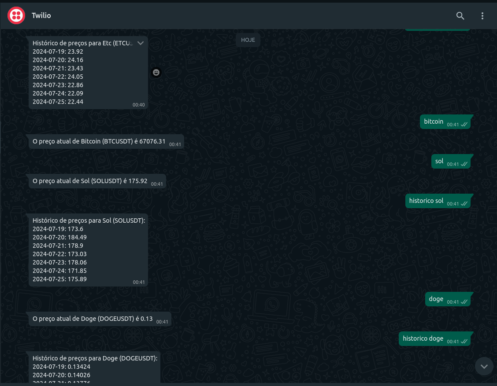

# Crypto Price Bot

Crypto Price Bot é uma aplicação que utiliza Twilio e a API da Binance para monitorar preços de criptomoedas e responder a mensagens no WhatsApp. O projeto reconhece os nomes de todas as moedas e mapeia esses nomes para seus respectivos símbolos na Binance.

## Funcionalidades

- Responde com o preço atual de uma criptomoeda.
- Retorna o histórico de preços das últimas 24 horas para uma criptomoeda específica.
- Permite configurar alertas de preço.
- Suporta todas as criptomoedas da Binance.

## Configuração

### Pré-requisitos

- Python 3.x
- Conta no Twilio
- Conta na Binance
- ngrok (opcional, para desenvolvimento local)

### Instalação

1. Clone o repositório:

   ```sh
   git clone https://github.com/seu-usuario/crypto-price-bot.git
   cd crypto-price-bot
   ```

2. Crie e ative um ambiente virtual:

   ```sh
   python -m venv venv
   source venv/bin/activate  # No Windows, use `venv\Scripts\activate`
   ```

3. Instale as dependências:

   ```sh
   pip install -r requirements.txt
   ```

4. Crie um arquivo `.env` e adicione suas chaves de API:

   ```env
   TWILIO_ACCOUNT_SID=your_twilio_account_sid
   TWILIO_AUTH_TOKEN=your_twilio_auth_token
   BINANCE_API_KEY=your_binance_api_key
   BINANCE_API_SECRET=your_binance_api_secret
   ```

5. Execute o servidor Flask:

   ```sh
   python testetwi.py
   ```

6. (Opcional) Use ngrok para expor seu servidor local:

   ```sh
   ngrok http 5000
   ```

### Configuração do Twilio

1. Vá até o console do Twilio e selecione seu número do WhatsApp Sandbox.
2. Na seção "A Message Comes In", insira a URL pública fornecida pelo ngrok ou a URL do seu servidor (ex: `http://abcd1234.ngrok.io/sms`).

## Uso

Envie uma mensagem para o número do WhatsApp Sandbox do Twilio com:

- O nome de uma criptomoeda (ex: "bitcoin") para receber o preço atual.
- "historico [nome_da_moeda]" (ex: "historico bitcoin") para receber o histórico de preços das últimas 24 horas.
- "comprar" ou "descartar" para testar respostas interativas.

## Exemplo de Uso

Veja abaixo um exemplo de uso da aplicação no WhatsApp:



## Contribuição

Se quiser contribuir, por favor faça um fork do repositório e envie um pull request com suas mudanças.

## Licença

Este projeto está licenciado sob a MIT License. Veja o arquivo [LICENSE](LICENSE) para mais detalhes.

